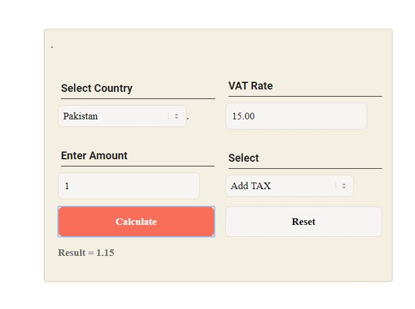
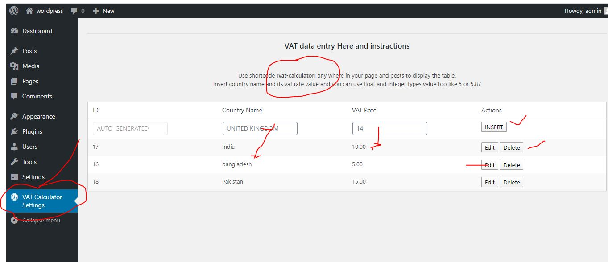

===== VAT Calculator===

Plugin Name: VAT Calculator
Plugin URI: https://www.upwork.com/fl/mdnazmul62
* Version:     1.0.1
Description: This plugin use to calculate VAT
Author: Md Nazmul
text-domain: vat_calculator
Author URI: https://www.upwork.com/fl/mdnazmul62
License: GNU General Public License v3.0

==== Description===

This is VAT calculator plugin for wordpress. This plugin all user to caculate VAT.

===Installation===:
 
Just download the zip file then go to wordpress Dashboard>>Plugins>Add new plugin>upload zip and activate.

===How to use==:

1. After install and activate the plugin you can see a admin menu called "VAT calculator settings".

2. In the settings page you can insert VAT country and VAT rate manually (no limit)

3. After insert data see above section where you can find a shortcode like "[vat-calculator]" just copy paste the shortcode 
anywhere in your pages or posts.

== Use shortcode==

see image below:

If you have any question feel free to ask me >> Developer@deshonlineit.com

Thanks.

